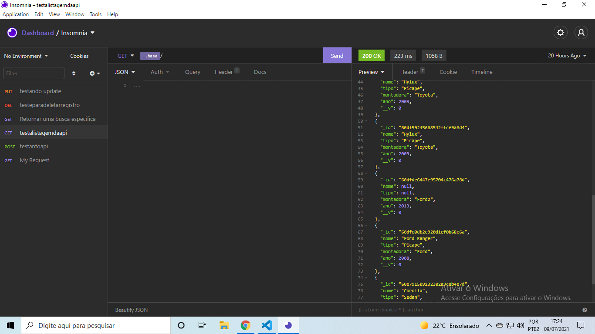

# apinode-carros

## Api criada para cadastrar carros com os campos: Nome, Tipo ( Ex: Suv, Sedan), montadora e ano veículo.

Desenvolvida usando a lib express v. 4.17.1, Mongoose v. 5.13.0  e node.js v. 14.15.1.

Deploy feito no heroku no endereço <a> https://apinode-carros.herokuapp.com/ <a/>. (ira para a rota get de exibição de todos os registros)
  
  Use o postman ou Insomnia para testar as rotas que não são GET, nos exemplos que vou deixar usei o insomnia.
  
### Rota n°1
  
  ("/") Metodo get que retorna todas os registros já cadastrados
  
  
  
### Rota n°2
  
  ("/search") Metodo get. Consulta por Nome, Tipo, e Montadora passados na query. Retorna os registros encontrados
  
  .png)
  
### Rota n°3
  
  ("/cars") Metodo post. Registra uma nova tabela com os campos passados na requisição.
  
  {
    "nome":
    "tipo":
    "montadora":
    "ano":
  }
  
  .png)
  
### Rota n°4
  
  ("/refresh/:id") Metodo put. Passado o id, atualiza campos que são passados na requisição
  
  .png)
  
### Rota n°5
  
  ("/:id") Metodo delete. Deleta um registro pelo id que foi passado.
  
  .png)
